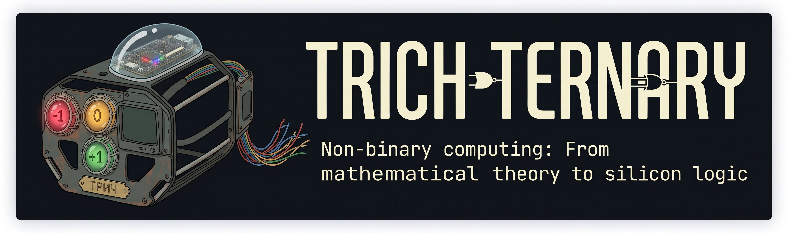
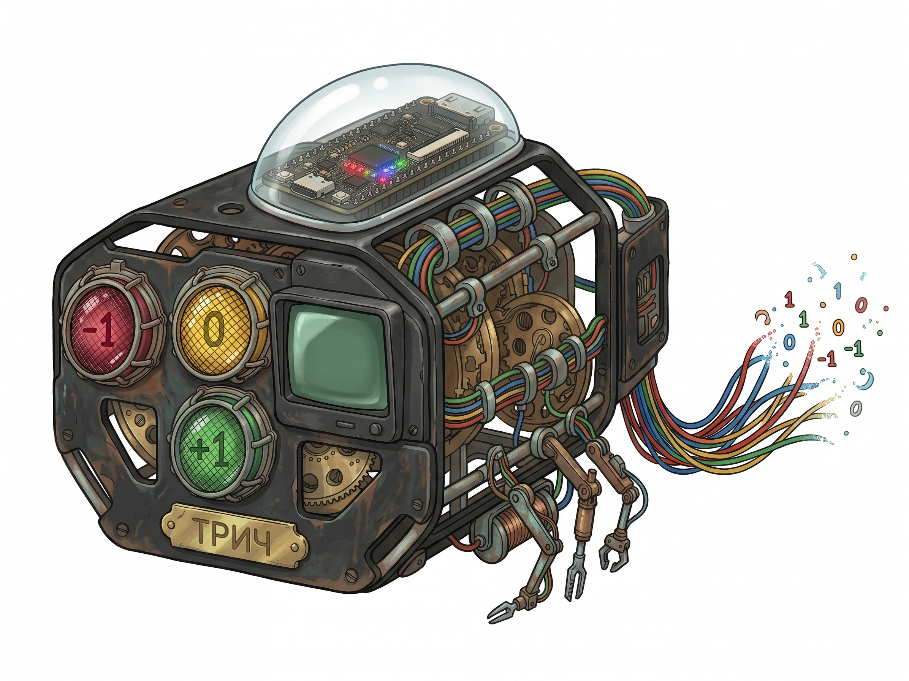
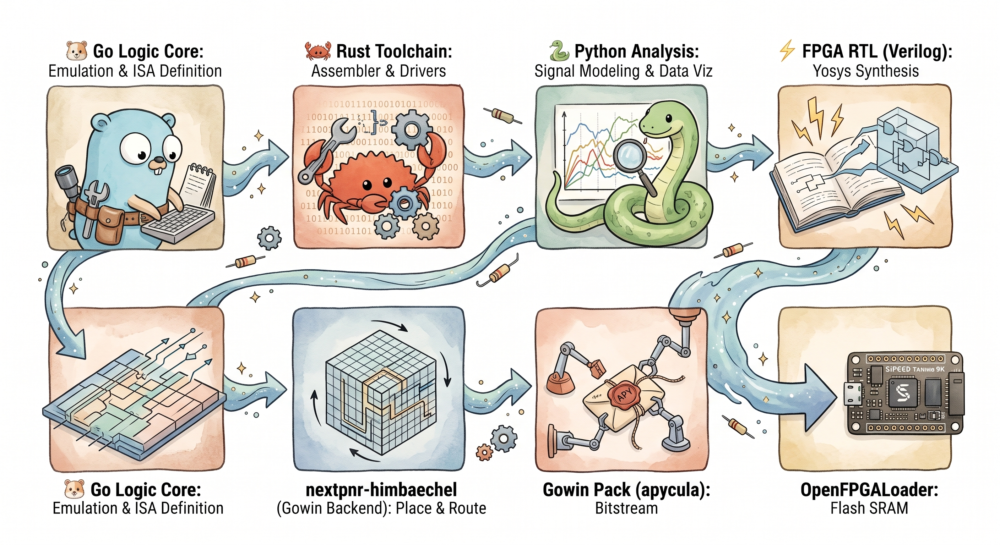
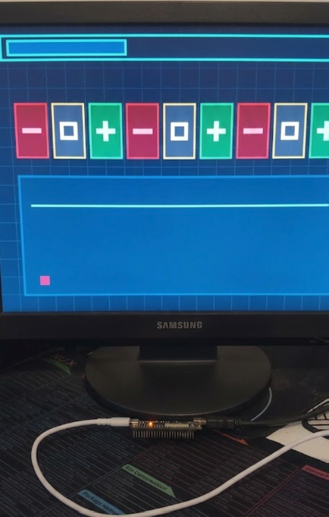
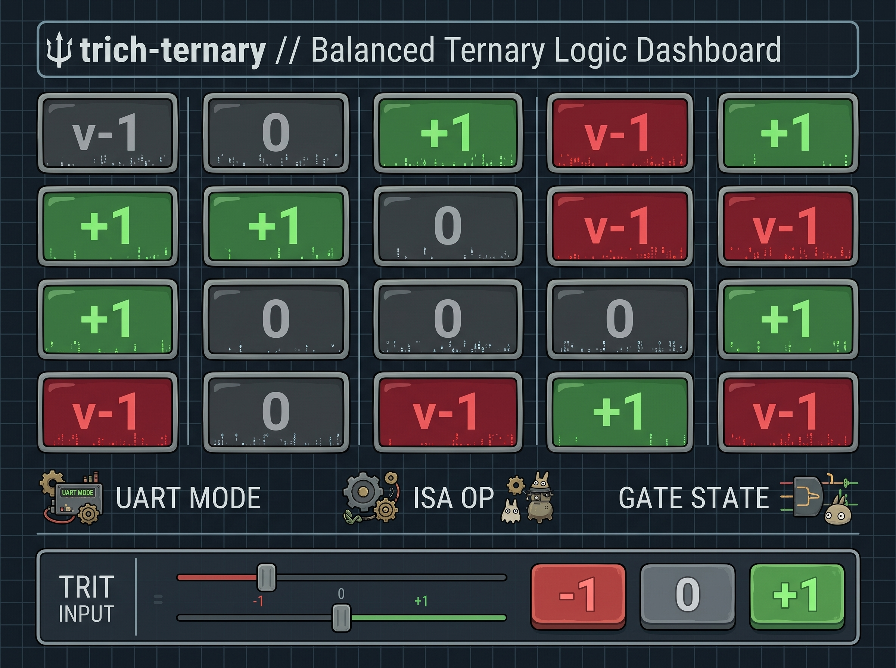

<div align="center">

# trich-ternary
### *Non-Binary Computing: From Mathematical Theory to Silicon Logic*

<p align="center">
  
</p>

[-00DCD2?style=for-the-badge&logo=math&logoColor=white)](https://en.wikipedia.org/wiki/Balanced_ternary)
[-FF6F00?style=for-the-badge&logo=fpga&logoColor=white)](https://wiki.sipeed.com/hardware/en/tang/Tang-Nano-9K/Nano-9K.html)
[](https://github.com/YosysHQ/oss-cad-suite-build)
[](hw/tang_nano_9k)
[](LICENSE)

<br>

<table>
  <tr>
    <td width="200" align="center" valign="middle">
      
      <br><sub><b>Trichka</b> — The Ternary Mascot</sub>
    </td>
    <td valign="middle">
      <b>trich-ternary</b> is an open-source hardware and software research initiative aimed at reviving, exploring, and realizing <b>Balanced Ternary (Base-3) computing</b>. Starting from theoretical discrete mathematics, passing through software virtual machines, and terminating in physical FPGA bitstreams and discrete transistor circuits, this project proves that computing is not bound to binary limits.
    </td>
  </tr>
</table>

</div>

---

## 📜 The Lore & Motivation

In the late 1950s at Moscow State University, Nikolay Brusentsov built the **Setun** computer. It was the first and only standardized computer in history to run natively on ternary logic rather than binary. While the commercial computing world rushed down the path of binary boolean algebra driven by silicon scaling economics, Setun quietly proved a profound mathematical truth: **Binary is an engineering compromise, not a mathematical absolute.**

Balanced Ternary operates on digits called **Trits** with the symmetric set:

$$\mathbb{T} = \{-1, 0, +1\} \quad \text{often denoted as} \quad \{\text{N}, 0, \text{P}\} \quad \text{or} \quad \{\bar{1}, 0, 1\}$$

```
          [ -1 ]                  [ 0 ]                  [ +1 ]
      Negative (N)             Zero (U)               Positive (P)
   Crimson / Low State    Slate / Neutral State   Emerald / High State
```

### Why Balanced Ternary?
1. **Natural Symmetry & No Two's Complement:** Negative values are represented with absolute mathematical symmetry. Negation is as simple as flipping $+1 \leftrightarrow -1$ while leaving $0$ unchanged ($\text{INV}(x) = -x$). There is no sign bit, no asymmetrical negative integer range, and zero overhead for subtraction ($A - B = A + (-B)$).
2. **Optimal Radix Economy ($e \approx 2.718$):** The theoretical optimum for radix economy in information theory is Euler's number $e$. Since $3$ is the closest integer to $e$ ($|3 - e| \approx 0.282$ vs $|2 - e| \approx 0.718$), Base-3 achieves higher information density per digit than Base-2.
3. **Rounding by Truncation:** Unbiased rounding to the nearest integer is achieved by simple truncation without any rounding bias or sticky bits.
4. **The Obsession:** What began as late-night rabbit holes exploring discrete ternary algebras quickly evolved into an engineering obsession: writing emulators in Go, crafting cross-compilers in Rust, synthesizing hardware on Gowin FPGAs, and designing discrete SMD transistor logic gates on physical PCBs.

> [!NOTE]
> *“Complexity is the enemy of execution. Elegance is the key to architecture.”*  
> `trich-ternary` is a relentless exploration to bring non-binary elegance to modern silicon.

---

## 🛠 Tech Stack & Toolchain Pipeline

We bridge the gap between mathematical foundations, high-performance systems software, and physical electronic logic.

<p align="center">
  
  <br>
  <em>Figure 1: Full-stack pipeline from mathematical specification to silicon compilation.</em>
</p>

| Layer | Technology | Purpose | Status |
| :--- | :--- | :--- | :--- |
| **Logic & VM Core** | **Go** | Fast ISA emulation, unit verification, reference math models |  |
| **Toolchain & ASM** | **Rust** | High-performance cross-assembler, bytecode parser, safe drivers |  |
| **FPGA Silicon** | **Verilog (GW1NR-9C)** | Hardware ALU, DVI/HDMI generator, UART bus, Gowin rPLL |  |
| **EDA Toolchain** | **OSS CAD Suite** | Yosys (Synthesis) $\to$ nextpnr-himbaechel (PnR) $\to$ gowin_pack |  |
| **Hardware Dashboard**| **C++ / AVR** | Physical touch-screen simulator (Arduino Mega + 2.4" TFT) |  |
| **Discrete Electronics**| **PCB / SMD** | 4-Trit Discrete Transistor Adder (30–60 SMD transistors) |  |

---

## 📐 Architecture & Balanced Ternary Reference

### 1. Hardware 2B1T Encoding (2 Bits per Trit)
In binary FPGA logic, each balanced trit is encoded into 2 binary wires:

$$\mathbf{2'b00} \equiv 0 \ (\text{Zero / U}), \quad \mathbf{2'b01} \equiv +1 \ (\text{Positive / P}), \quad \mathbf{2'b10} \equiv -1 \ (\text{Negative / N})$$

*(Value `2'b11` is reserved / invalid).*

```
      +-------------+-------------+-----------------------+
      |  2B1T Code  | Trit Value  | Visual Representation |
      +-------------+-------------+-----------------------+
      |    2'b01    |     +1      |   [ + ]  Emerald      |
      |    2'b00    |      0      |   [ 0 ]  Dark Slate   |
      |    2'b10    |     -1      |   [ - ]  Crimson      |
      +-------------+-------------+-----------------------+
```

---

### 2. Fundamental Ternary Gate Truth Tables

#### A. Ternary AND ($\text{MIN}$) & Ternary OR ($\text{MAX}$)
$$\text{MIN}(A, B) = \min(A, B) \qquad \text{MAX}(A, B) = \max(A, B)$$

| $A$ | $B$ | $\text{MIN}(A,B)$ (AND) | $\text{MAX}(A,B)$ (OR) | $\text{XOR}(A,B)$ | $\text{MUL}(A,B)$ |
| :---: | :---: | :---: | :---: | :---: | :---: |
| **$+1$** | **$+1$** | $+1$ | $+1$ | $0$ | $+1$ |
| **$+1$** | **$0$** | $0$ | $+1$ | $+1$ | $0$ |
| **$+1$** | **$-1$** | $-1$ | $+1$ | $-1$ | $-1$ |
| **$0$** | **$+1$** | $0$ | $+1$ | $+1$ | $0$ |
| **$0$** | **$0$** | $0$ | $0$ | $0$ | $0$ |
| **$0$** | **$-1$** | $-1$ | $0$ | $+1$ | $0$ |
| **$-1$** | **$+1$** | $-1$ | $+1$ | $-1$ | $-1$ |
| **$-1$** | **$0$** | $-1$ | $0$ | $+1$ | $0$ |
| **$-1$** | **$-1$** | $-1$ | $-1$ | $0$ | $+1$ |

#### B. Unary Operations: Inversion ($\text{INV}$) & Successor ($\text{CYCLE}$)
$$\text{INV}(A) = -A \qquad \text{CYCLE}(A) = (A + 1) \pmod 3$$

| Input $A$ | $\text{INV}(A)$ (NOT) | $\text{CYCLE}(A)$ (Successor) |
| :---: | :---: | :---: |
| **$+1$** | $-1$ | $-1$ |
| **$0$** | $0$ | $+1$ |
| **$-1$** | $+1$ | $0$ |

#### C. Balanced Ternary Full Adder
The balanced ternary full adder adds $A + B + C_{in} = \text{Sum} + 3 \times C_{out}$ across the integer range $[-3, +3]$:

| Total Sum ($A+B+C_{in}$) | Resulting Sum Trit | Carry Out Trit ($C_{out}$) | Algebraic Equivalence |
| :---: | :---: | :---: | :---: |
| **$+3$** | $0$ | $+1$ | $+3 = (+1 \times 3) + 0$ |
| **$+2$** | $-1$ | $+1$ | $+2 = (+1 \times 3) - 1$ |
| **$+1$** | $+1$ | $0$ | $+1 = (0 \times 3) + 1$ |
| **$0$** | $0$ | $0$ | $0 = (0 \times 3) + 0$ |
| **$-1$** | $-1$ | $0$ | $-1 = (0 \times 3) - 1$ |
| **$-2$** | $+1$ | $-1$ | $-2 = (-1 \times 3) + 1$ |
| **$-3$** | $0$ | $-1$ | $-3 = (-1 \times 3) + 0$ |

---

## ⚡ Silicon Verification & Live Output

### 1. Tang Nano 9K FPGA DVI/HDMI Core (`hw/tang_nano_9k/`)
We implemented a complete hardware-accelerated balanced ternary visualizer in native Verilog for the **Sipeed Tang Nano 9K** (Gowin GW1NR-9C).

<p align="center">
  
  <br>
  <em>Figure 2: Physical proof-of-concept — 640x480 @ 60Hz DVI/HDMI output generated natively from FPGA logic on a Tang Nano 9K.</em>
</p>

#### Hardware Submodule Architecture:
- **`gowin_rpll.v`:** Generates 126.0 MHz serial TMDS clock ($5\times$) and 25.2 MHz pixel clock from the onboard 27 MHz crystal.
- **`video_gen.v`:** VGA 640x480 @ 60 Hz sync engine + Retro-Scientific UI compositor with live geometric trit glyphs.
- **`ternary_alu.v`:** 2B1T Full Adder, MIN, MAX, Inverter, XOR, Cycle, and Multiplier ALU.
- **`uart_rx.v`:** 115200 Baud receiver (Pin 18) with noise debouncing and multi-mode command decoder.
- **`tmds_encoder.v`:** DVI 1.0 8b/10b DC-balanced encoder with sync token insertion.
- **`dvi_transmitter.v`:** Gowin `OSER10` 10:1 DDR serializers and `ELVDS_OBUF` differential output drivers.

---

### 2. Standalone MCU Hardware Dashboard (`hw/Ternaryrator_Dashboard/`)
Before building on FPGA silicon, a dedicated hardware simulator was engineered using an **Arduino Mega 2560** and a **2.4" MCUFRIEND Touch Shield (ILI9341)** with 100% static RAM allocation and custom rendering primitives.

<p align="center">
  
  <br>
  <em>Figure 3: Interactive Touch Dashboard for live Balanced Ternary ALU arithmetic and truth table exploration.</em>
</p>

---

## 🚀 Quick Start & Hardware Build

### Prerequisites
Install the open-source FPGA toolchain (**OSS CAD Suite**):
- [Yosys HQ / OSS CAD Suite](https://github.com/YosysHQ/oss-cad-suite-build) (Includes `yosys`, `nextpnr-himbaechel`, `gowin_pack`, `openFPGALoader`).

### Build and Flash Tang Nano 9K
```bash
# Clone the repository
git clone https://github.com/Ri4ards2006/Ternary-trich-.git
cd Ternary-trich-/hw/tang_nano_9k

# 1. Synthesize, Place & Route, and Pack Bitstream
make

# 2. Upload to Tang Nano 9K SRAM (fast test)
make flash-sram

# 3. Flash permanently into Onboard SPI Flash
make flash
```

### Interactive UART Control (115200 Baud)
Connect to the onboard USB-UART bridge (Pin 18, 115200 8-N-1) using PuTTY, `screen`, or `minicom`:

```bash
picocom -b 115200 /dev/ttyUSB1
```

| Key / Command | Action |
| :--- | :--- |
| **`1` / `0x01`** | Switch to **Mode 1: 9-Trit Register Matrix** View |
| **`2` / `0x02`** | Switch to **Mode 2: Balanced ALU / Full Adder** Live View |
| **`3` / `0x03`** | Switch to **Mode 3: Truth Table & Logic Gate** Explorer |
| **`a` / `A`** | Cycle ALU Operand $A$ ($-1 \to 0 \to +1 \to -1$) |
| **`b` / `B`** | Cycle ALU Operand $B$ |
| **`c` / `C`** | Cycle ALU Carry In $C_{in}$ |
| **`o` / `O`** | Cycle Active Operation (ADD $\to$ MIN $\to$ MAX $\to$ INV $\to$ XOR $\to$ CYC) |
| **`+` / `p`** | Push $+1$ into the 9-Trit Register and shift left |
| **`0` / `u`** | Push $0$ into the 9-Trit Register and shift left |
| **`-` / `n`** | Push $-1$ into the 9-Trit Register and shift left |
| **`s` / `S`** | Rotate register contents |
| **`r` / `R`** | Clear all registers to zero |

---

## 🗺 Roadmap & Milestones

- [x] **Phase 1: Mathematical Foundations & Logic Simulator**
  - [x] Symmetrical 2B1T algebraic representation.
  - [x] Interactive MCU hardware dashboard (`hw/Ternaryrator_Dashboard`).
  - [x] Reference truth tables and Full Adder algorithms.
- [x] **Phase 2: FPGA Silicon Prototyping (Tang Nano 9K)**
  - [x] Custom DVI/HDMI 640x480 @ 60 Hz TMDS transmitter in Verilog.
  - [x] Full Open-Source EDA compilation (Yosys + NextPNR + Apycula).
  - [x] Dynamic UART-RX telemetry and visualizer engine.
- [ ] **Phase 3: Cross-Assembler & Software Ecosystem (Rust & Go)**
  - [ ] Ternary Instruction Set Architecture (T-ISA) definition.
  - [ ] Rust cross-assembler and bytecode compiler.
  - [ ] Cycle-accurate Go virtual machine with signal debugger.
- [ ] **Phase 4: Physical Discrete Transistor Logic**
  - [ ] 4-Trit Balanced Adder designed with discrete NPN/PNP SMD transistors.
  - [ ] Custom PCB manufacturing and oscillographic signal integrity validation.

---

## 📊 Evaluation & Metrics

How do we measure success?
1. **Radix Efficiency:** Can we demonstrate fewer interconnect lines and gate stages compared to 2's complement binary?
2. **Silicon Footprint:** Resource utilization density across Gowin LUT4s and custom transistor gates.
3. **Accuracy & Determinism:** Exact mathematical correlation between Go virtual emulation and physical FPGA/PCB outputs.

---

## 📄 License

Distributed under the **MIT License**. See [`LICENSE`](LICENSE) for complete details.

---

<div align="center">
  <sub>Engineered with obsession for non-binary logic. Built by <a href="https://github.com/Ri4ards2006">Richard Zuikov</a>.</sub>
</div>
